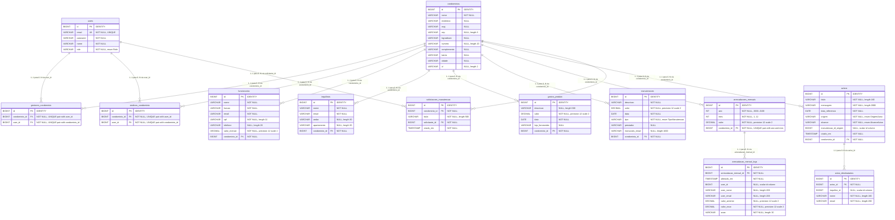

```mermaid
erDiagram
    users {
        BIGINT id PK "IDENTITY"
        VARCHAR email UK "NOT NULL, UNIQUE"
        VARCHAR password "NOT NULL"
        VARCHAR nome "NOT NULL"
        VARCHAR role "NOT NULL, enum Role"
    }

    condominios {
        BIGINT id PK "IDENTITY"
        VARCHAR nome "NOT NULL"
        VARCHAR endereco "NULL"
        VARCHAR cnpj "NULL"
        VARCHAR cep "NULL, length 8"
        VARCHAR logradouro "NULL"
        VARCHAR numero "NULL, length 20"
        VARCHAR complemento "NULL"
        VARCHAR bairro "NULL"
        VARCHAR cidade "NULL"
        VARCHAR uf "NULL, length 2"
    }

    gestores_condominio {
        BIGINT id PK "IDENTITY"
        BIGINT condominio_id FK "NOT NULL, UNIQUE pair with user_id"
        BIGINT user_id FK "NOT NULL, UNIQUE pair with condominio_id"
    }

    sindicos_condominio {
        BIGINT id PK "IDENTITY"
        BIGINT condominio_id FK "NOT NULL, UNIQUE pair with user_id"
        BIGINT user_id FK "NOT NULL, UNIQUE pair with condominio_id"
    }

    funcionarios {
        BIGINT id PK "IDENTITY"
        VARCHAR nome "NOT NULL"
        VARCHAR funcao "NOT NULL"
        VARCHAR email "NOT NULL"
        VARCHAR cpf "NOT NULL, length 11"
        VARCHAR telefone "NULL, length 20"
        DECIMAL valor_mensal "NOT NULL, precision 12 scale 2"
        BIGINT condominio_id FK "NOT NULL"
    }

    inquilinos {
        BIGINT id PK "IDENTITY"
        VARCHAR nome "NOT NULL"
        VARCHAR email "NOT NULL"
        VARCHAR andar "NULL, length 30"
        VARCHAR apartamento "NULL, length 30"
        BIGINT condominio_id FK "NOT NULL"
    }

    gastos_produto {
        BIGINT id PK "IDENTITY"
        VARCHAR descricao "NULL, length 500"
        DECIMAL valor "NOT NULL, precision 12 scale 2"
        DATE data "NOT NULL"
        VARCHAR loja_fornecedor "NULL"
        BIGINT condominio_id FK "NOT NULL"
    }

    manutencoes {
        BIGINT id PK "IDENTITY"
        VARCHAR descricao "NOT NULL"
        DECIMAL valor "NOT NULL, precision 12 scale 2"
        DATE data "NOT NULL"
        VARCHAR tipo "NOT NULL, enum TipoManutencao"
        VARCHAR prestador "NULL"
        VARCHAR instrucoes_email "NULL, length 1000"
        BIGINT condominio_id FK "NOT NULL"
    }

    arrecadacoes_mensais {
        BIGINT id PK "IDENTITY"
        INT ano "NOT NULL, 2000..2100"
        INT mes "NOT NULL, 1..12"
        DECIMAL valor "NOT NULL, precision 12 scale 2"
        BIGINT condominio_id FK "NOT NULL, UNIQUE pair with ano and mes"
    }

    arrecadacao_mensal_logs {
        BIGINT id PK "IDENTITY"
        BIGINT arrecadacao_mensal_id FK "NOT NULL"
        TIMESTAMP alterado_em "NOT NULL"
        BIGINT user_id "NULL, scalar id column"
        VARCHAR user_nome "NULL, length 200"
        VARCHAR user_email "NULL, length 200"
        DECIMAL valor_anterior "NULL, precision 12 scale 2"
        DECIMAL valor_novo "NOT NULL, precision 12 scale 2"
        VARCHAR acao "NOT NULL, length 30"
    }

    avisos {
        BIGINT id PK "IDENTITY"
        VARCHAR titulo "NOT NULL, length 160"
        VARCHAR mensagem "NOT NULL, length 2000"
        DATE data_referencia "NOT NULL"
        VARCHAR origem "NOT NULL, enum OrigemAviso"
        VARCHAR alcance "NOT NULL, enum AlcanceAviso"
        BIGINT manutencao_id_origem "NULL, scalar id column"
        TIMESTAMP criado_em "NOT NULL"
        BIGINT condominio_id FK "NOT NULL"
    }

    aviso_destinatarios {
        BIGINT id PK "IDENTITY"
        BIGINT aviso_id FK "NOT NULL"
        BIGINT inquilino_id "NULL, scalar id column"
        VARCHAR nome "NOT NULL, length 160"
        VARCHAR email "NOT NULL, length 200"
    }

    solicitacoes_manutencao {
        BIGINT id PK "IDENTITY"
        BIGINT condominio_id FK "NOT NULL"
        VARCHAR titulo "NOT NULL, length 500"
        BIGINT solicitante_id FK "NOT NULL"
        TIMESTAMP criado_em "NOT NULL"
    }

    condominios ||--o{ gestores_condominio : "1..1 para 0..N via condominio_id"
    users ||--o{ gestores_condominio : "1..1 para 0..N via user_id"
    condominios ||--o{ sindicos_condominio : "1..1 para 0..N via condominio_id"
    users ||--o{ sindicos_condominio : "1..1 para 0..N via user_id"
    condominios ||--o{ funcionarios : "1..1 para 0..N via condominio_id"
    condominios ||--o{ inquilinos : "1..1 para 0..N via condominio_id"
    condominios ||--o{ gastos_produto : "1..1 para 0..N via condominio_id"
    condominios ||--o{ manutencoes : "1..1 para 0..N via condominio_id"
    condominios ||--o{ arrecadacoes_mensais : "1..1 para 0..N via condominio_id"
    arrecadacoes_mensais ||--o{ arrecadacao_mensal_logs : "1..1 para 0..N via arrecadacao_mensal_id"
    condominios ||--o{ avisos : "1..1 para 0..N via condominio_id"
    avisos ||--o{ aviso_destinatarios : "1..1 para 0..N via aviso_id"
    condominios ||--o{ solicitacoes_manutencao : "1..1 para 0..N via condominio_id"
    users ||--o{ solicitacoes_manutencao : "1..1 para 0..N via solicitante_id"
```
