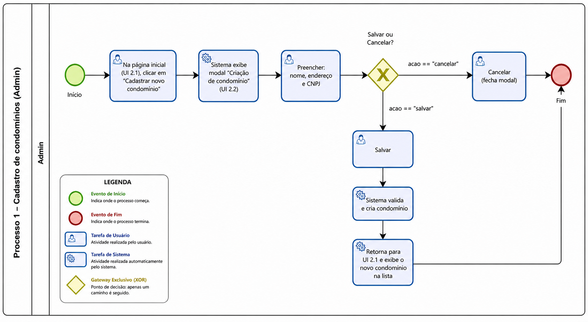
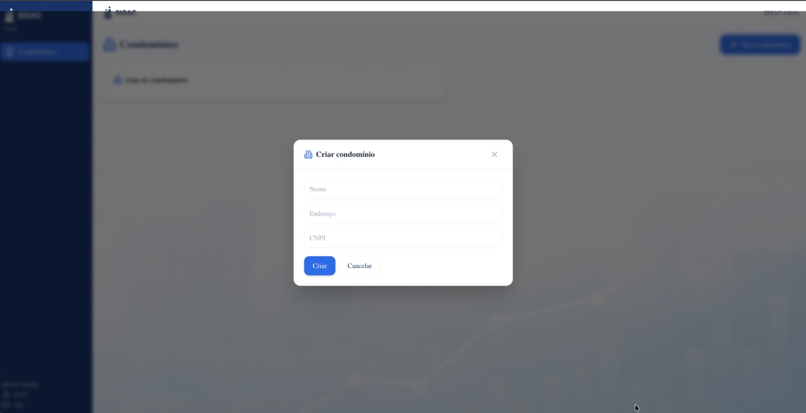

### 3.3.1 Processo 1 – Cadastro de condomínios

**Nome do Processo:** Cadastro de Condomínios

**Observação de alinhamento com UI:** Este processo foi ajustado para refletir a tela **"Criação de condomínio"** do wireframe (docs/ui/_ui.md, seção 2.2), que contém apenas os campos **nome**, **endereço** e **CNPJ**. Campos adicionais (ex.: quantidade de unidades, data de fundação, tipo de condomínio, síndico, anexos e validações internas) podem existir como regras/cadastros complementares em processos futuros, mas **não fazem parte** desta tela conforme o UI atual.

**Oportunidades de melhoria:**

  * **Automação na Validação:** Integrar o formulário de cadastro com a API da Receita Federal para validar automaticamente o CNPJ e preencher dados básicos, reduzindo erros de digitação.
  * **Normalização de Endereço:** Integrar com API de CEP (ex.: ViaCEP) para sugerir/preencher endereço.

#### Detalhamento das atividades

**Cadastrar condomínio (Admin)**

> Corresponde ao modal **"Criação de condomínio"** (UI 2.2).

| **Campo** | **Tipo** | **Restrições** | **Valor default** |
| --- | --- | --- | --- |
| nome | Caixa de texto | Obrigatório, máximo de 100 caracteres | |
| endereco | Caixa de texto | Obrigatório, máximo de 200 caracteres | |
| cnpj | Caixa de texto | Obrigatório, formato de CNPJ (XX.XXX.XXX/XXXX-XX) | |

| **Comandos** | **Destino** | **Tipo** |
| --- | --- | --- |
| Salvar | Lista de condomínios (Página inicial do administrador) | default |
| Cancelar | Fecha modal / mantém na Página inicial do administrador | cancel |

**Resultado esperado**

- Condomínio criado e exibido na lista da **Página inicial do administrador**.
- Condomínio disponível para ações subsequentes do Admin, como **vincular gestores e síndicos** (processos relacionados ao fluxo 2.3+ do UI).
  

