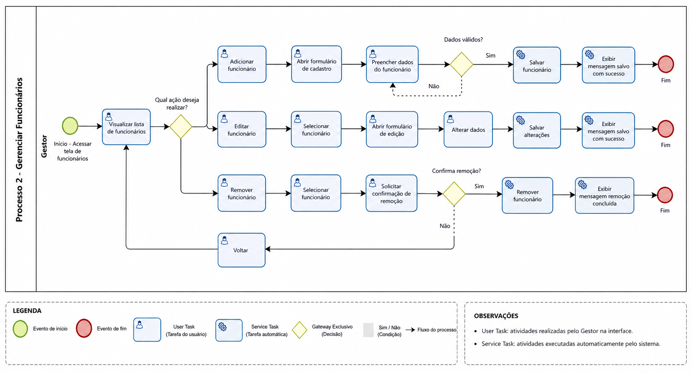

### 3.3.2 Processo 2 – Cadastro de funcionários

**Nome do Processo (UI):** Cadastro de Funcionários

**Observação de alinhamento com UI:** O wireframe disponível (docs/ui/_ui.md, seção **3.2 Tela de funcionários**) descreve uma tela que lista funcionários com os campos **nome**, **função**, **valor_mensal** e ações. Não há referência a “prestadores” na UI.

Assim, este processo foi ajustado para refletir o que a UI propõe: **CRUD simples de funcionários**.

#### Detalhamento das atividades

**Listar funcionários (Gestor)**

> Corresponde à tela **"Tela de funcionários"** (UI 3.2).

| **Dados exibidos (tabela)** | **Tipo** | **Observações** |
| --- | --- | --- |
| nome | Texto | Somente leitura na listagem |
| funcao | Texto | Somente leitura na listagem |
| valor_mensal | Moeda | Somente leitura na listagem |
| acoes | Botões/ícones | Editar / Remover |

| **Comandos** | **Destino** | **Tipo** |
| --- | --- | --- |
| Novo funcionário | Modal/Form de cadastro de funcionário | default |
| Editar (linha) | Modal/Form de edição de funcionário | default |
| Remover (linha) | Confirmação de remoção | cancel |

**Cadastrar funcionário (Gestor)**

| **Campo** | **Tipo** | **Restrições** | **Valor default** |
| --- | --- | --- | --- |
| nome | Caixa de texto | Obrigatório, máximo de 100 caracteres | |
| funcao | Caixa de texto/Seleção | Obrigatório, máximo de 50 caracteres | |
| valor_mensal | Número (moeda) | Obrigatório, valor > 0 | 0.00 |

| **Comandos** | **Destino** | **Tipo** |
| --- | --- | --- |
| Salvar | Retorna para listagem com funcionário incluído | default |
| Cancelar | Retorna para listagem sem alterações | cancel |

**Editar funcionário (Gestor)**

| **Campo** | **Tipo** | **Restrições** | **Valor default** |
| --- | --- | --- | --- |
| nome | Caixa de texto | Obrigatório, máximo de 100 caracteres | (pré-preenchido) |
| funcao | Caixa de texto/Seleção | Obrigatório, máximo de 50 caracteres | (pré-preenchido) |
| valor_mensal | Número (moeda) | Obrigatório, valor > 0 | (pré-preenchido) |

| **Comandos** | **Destino** | **Tipo** |
| --- | --- | --- |
| Salvar alterações | Retorna para listagem com dados atualizados | default |
| Cancelar | Retorna para listagem sem alterações | cancel |

**Remover funcionário (Gestor)**

| **Campo** | **Tipo** | **Restrições** | **Valor default** |
| --- | --- | --- | --- |
| confirmacao | Confirmação | Obrigatório confirmar ação | |

| **Comandos** | **Destino** | **Tipo** |
| --- | --- | --- |
| Confirmar remoção | Retorna para listagem sem o funcionário | default |
| Cancelar | Retorna para listagem sem alterações | cancel |

