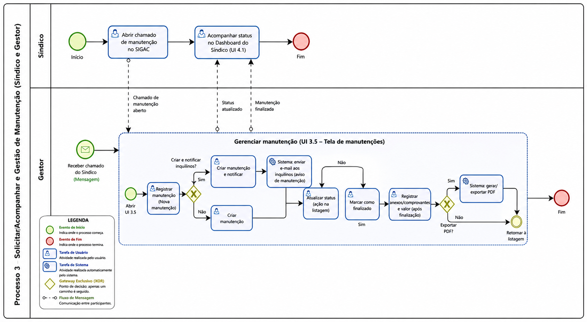
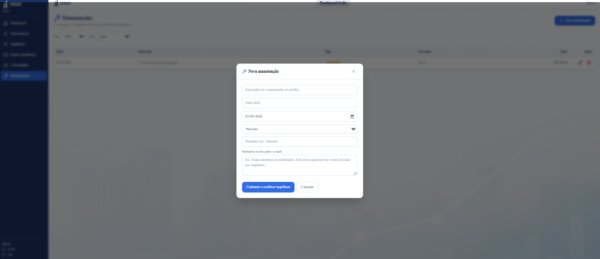
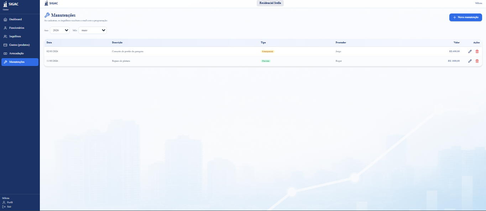
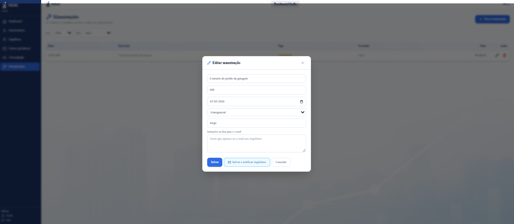
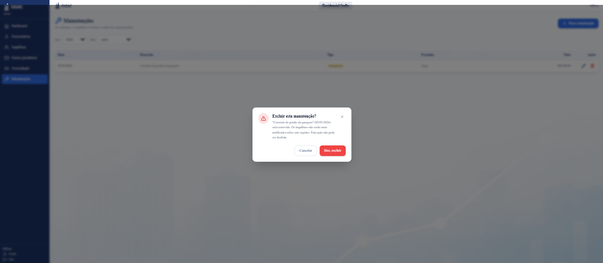

### 3.3.3 Processo 3 – Gestão de Manutenção

**Nome do Processo:** Gestão de Manutenção

**Oportunidades de melhoria:**

  * **Notificações automáticas integradas:** Implementar o envio automático de alertas (SMS ou e-mail) para o Prestador de serviços assim que a manutenção for criada, e para o Síndico quando o status for atualizado ou o serviço for finalizado.
  * **Envio mobile de comprovativos:** Permitir que o próprio Prestador anexe os comprovativos e notas fiscais diretamente através de uma aplicação móvel no local da "Execução do serviço".

#### Alinhamento com as telas do UI (Wireframe)

De acordo com o documento **docs/ui/_ui.md**, a **Gestão de Manutenções** ocorre principalmente na **Tela de Manutenções (Fluxo do Gestor – item 3.5)**, que apresenta uma listagem em tabela com os campos:

- **data**
- **descricao**
- **tipo**
- **prestador**
- **valor**
- **acoes**

E possui a ação principal **"Nova manutenção"**, que inicia o cadastro.

> Observação: o wireframe não detalha telas específicas do prestador. Portanto, as etapas de execução do serviço e envio de comprovantes permanecem previstas como parte do processo, mas no escopo da interface atual elas podem ser tratadas como ações/estados acompanhados pelo Gestor (e consultáveis pelo Síndico).

---

#### Detalhamento das atividades (mapeado para UI)

### 1) Listar manutenções (Tela de Manutenções – Gestor)

**Objetivo:** permitir ao Gestor acompanhar e gerenciar todas as manutenções do condomínio.

**Componentes (conforme UI):**

| **Coluna** | **Origem no processo** | **Observações** |
| --- | --- | --- |
| data | data_agendamento / data_criacao | Exibir a data de abertura ou agendamento (definir padrão no sistema). |
| descricao | descricao_servico | Resumo do problema/serviço. |
| tipo | tipo_manutencao | Campo não existia no processo anterior → incluído para aderir ao wireframe. |
| prestador | prestador_associado | Prestador vinculado. |
| valor | valor_total_servico | Quando não houver valor final, exibir vazio/"a definir". |
| acoes | comandos do processo | Ex.: ver detalhes, editar, atualizar status, anexos/relatório. |

**Ações (UI):**
- **Nova manutenção** → abre o fluxo “Criar manutenção”.
- **Ações por linha** (sugestão para aderência ao wireframe):
  - Ver/Editar
  - Atualizar status
  - Ver anexos/comprovantes
  - Exportar PDF (quando finalizada)

---

### 2) Criar manutenção (iniciado por “Nova manutenção”)

**Tela/Modal:** disparado a partir da Tela de Manutenções.

| **Campo** | **Tipo** | **Restrições** | **Valor default** |
| --- | --- | --- | --- |
| id_manutencao | Número | Gerado automaticamente, apenas leitura | |
| tipo_manutencao | Seleção única | **Obrigatório** (ex.: Elétrica, Hidráulica, Estrutural, Limpeza, Outros) | |
| prestador_associado | Seleção única | Obrigatório (Lista de prestadores ativos) | |
| descricao_servico | Área de texto | Obrigatório, detalhamento do problema | |
| data_agendamento | Data e Hora | Obrigatório, não pode ser no passado | |
| nivel_prioridade | Seleção única | Obrigatório (Baixa, Média, Alta, Urgente) | Média |

| **Comandos** | **Destino** | **Tipo** |
| --- | --- | --- |
| Criar | Retorna para “Tela de manutenções” com item criado | default |
| Criar e Notificar | Inicia acompanhamento (status “Em andamento”) e notifica envolvidos | default |
| Cancelar | Retorna para “Tela de manutenções��� sem salvar | cancel |

**Notificações (conforme UI):**
- Inquilinos recebem e-mail quando uma manutenção é cadastrada (mencionado no wireframe).

---

### 3) Atualizar status do serviço (ação na listagem)

**Tela/Modal:** acionado a partir de **Ações** da manutenção na Tela de Manutenções.

| **Campo** | **Tipo** | **Restrições** | **Valor default** |
| --- | --- | --- | --- |
| status_atual | Seleção única | Obrigatório (Em andamento, Aguarda peça, Finalizado) | Em andamento |
| notas_acompanhamento | Área de texto | Opcional, histórico do acompanhamento | |

| **Comandos** | **Destino** | **Tipo** |
| --- | --- | --- |
| Atualizar | Mantém na Tela de Manutenções e atualiza a linha/registro | default |
| Marcar como Finalizado | Habilita registro de comprovantes/valores e permite exportação | default |

---

### 4) Registrar comprovantes e valores (ação na listagem)

**Tela/Modal:** acionado a partir de **Ações** após execução/finalização.

> Ajuste de escopo para aderência ao wireframe: como não há tela do Prestador, o upload/registro pode ser feito pelo Gestor (ou por integração futura). O processo mantém a possibilidade de anexos (fiscais/recibos) para consolidar o valor exibido na tabela.

| **Campo** | **Tipo** | **Restrições** | **Valor default** |
| --- | --- | --- | --- |
| documento_fiscal | Arquivo | Obrigatório, formatos: PDF, JPG, PNG | |
| comprovativo_pagamento | Arquivo | Obrigatório, recibo ou transferência (PDF) | |
| valor_total_servico | Número | Obrigatório, validação do custo final | |
| observacoes_tecnicas | Área de texto | Opcional | |

| **Comandos** | **Destino** | **Tipo** |
| --- | --- | --- |
| Salvar | Retorna para a Tela de Manutenções atualizando a coluna “valor” | default |

---

### 5) Consultar histórico / Exportar PDF (Síndico e Gestor)

**Tela:** no wireframe, o Síndico possui dashboard de leitura; a consulta de histórico pode ser acessada via listagem/relatórios.

| **Campo** | **Tipo** | **Restrições** | **Valor default** |
| --- | --- | --- | --- |
| detalhes_conclusao | Área de texto | Apenas leitura (Resumo da operação) | |
| tabela_custos | Tabela | Apenas leitura (peças e mão de obra) | |
| data_fecho | Data e Hora | Apenas leitura | Data/Hora atual |

| **Comandos** | **Destino** | **Tipo** |
| --- | --- | --- |
| Exportar PDF | Download do relatório | default |
| Arquivar e Concluir | Final do processo | default |

