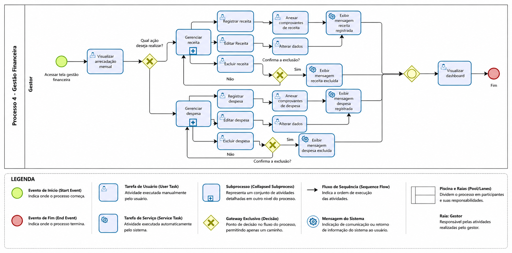
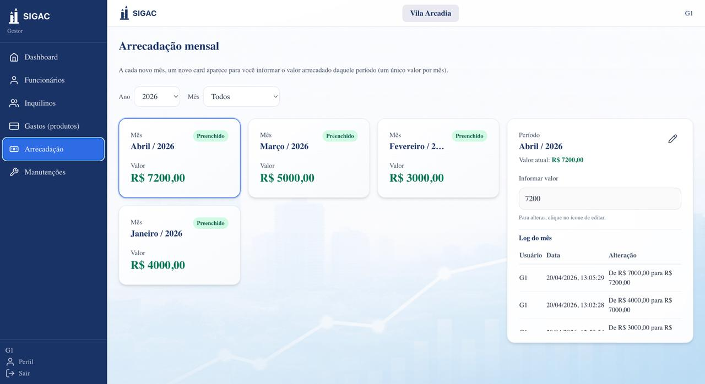
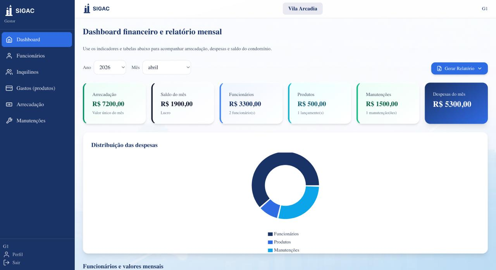

### 3.3.3 Processo 4 – Gestão Financeira

**Nome do Processo:** Gestão Financeira (Receitas e Despesas)

**Telas relacionadas (UI):**

- **UI 5.1 - Tela de gestao financeira (visao geral / dashboard)**: consolidado do periodo, graficos e acompanhamento.
- **UI 5.2 - Tela de gestao financeira (lancamentos / detalhamento)**: cadastro e consulta de receitas/despesas, anexos e geracao de relatorio.

**Oportunidades de melhoria:**

  * **Conciliação Bancária Automática:** Integrar o sistema com a API do banco ou permitir a importação de arquivos OFX para que os lançamentos de receitas (como pagamento de boletos pelos m[...]
  * **Dashboards Dinâmicos:** Em vez de depender apenas da atividade "Gerar relatório", criar um painel interativo (dashboard) em tempo real para o Síndico, enviando notificações automáticas[...]

#### Detalhamento das atividades

**Registrar receita**

| **Campo** | **Tipo** | **Restrições** | **Valor default** |
| --- | --- | --- | --- |
| descricao\_receita | Caixa de texto | Obrigatório, máximo de 100 caracteres | |
| valor\_receita | Número | Obrigatório, valor \> 0 (formato monetário) | |
| data\_recebimento | Data | Obrigatório, não pode ser data futura | |
| categoria\_receita | Seleção única | Obrigatório (Ex: Taxa Condominial, Multa, Aluguel de Salão) | Taxa Condominial |
| unidade\_pagadora | Caixa de texto | Obrigatório (Ex: Bloco A, Apto 101) | |

| **Comandos** | **Destino** | **Tipo** |
| --- | --- | --- |
| Salvar e Continuar | Atividade "Registrar despesa" | default |
| Cancelar | Fim do Processo | cancel |

**Registrar despesa**

| **Campo** | **Tipo** | **Restrições** | **Valor default** |
| --- | --- | --- | --- |
| descricao\_despesa | Caixa de texto | Obrigatório, máximo de 100 caracteres | |
| valor\_despesa | Número | Obrigatório, valor \> 0 (formato monetário) | |
| data\_vencimento | Data | Obrigatório | |
| data\_pagamento | Data | Opcional (preencher se já estiver pago) | |
| categoria\_despesa | Seleção única | Obrigatório (Ex: Água, Energia, Folha de Pagamento, Manutenção) | |

| **Comandos** | **Destino** | **Tipo** |
| --- | --- | --- |
| Avançar para Anexos | Atividade "Anexar comprovante" | default |
| Voltar | Atividade "Registrar receita" | |

**Anexar comprovante**

| **Campo** | **Tipo** | **Restrições** | **Valor default** |
| --- | --- | --- | --- |
| nota\_fiscal | Arquivo | Opcional, formatos: PDF, JPG, PNG, máx 5MB | |
| comprovante\_pagamento | Arquivo | Obrigatório para despesas pagas (PDF, JPG) | |
| observacoes\_lancamento | Área de texto | Opcional, máximo de 300 caracteres | |

| **Comandos** | **Destino** | **Tipo** |
| --- | --- | --- |
| Salvar Documentos | Atividade "Gerar relatório" | default |
| Voltar | Atividade "Registrar despesa" | |

**Gerar relatório**

| **Campo** | **Tipo** | **Restrições** | **Valor default** |
| --- | --- | --- | --- |
| periodo\_relatorio | Seleção única | Obrigatório (Mensal, Trimestral, Anual) | Mensal |
| mes\_referencia | Data | Obrigatório (Selecionar mês/ano) | Mês atual |
| formato\_exportacao | Seleção múltipla | Obrigatório (PDF, Excel, CSV) | PDF |

| **Comandos** | **Destino** | **Tipo** |
| --- | --- | --- |
| Emitir e Notificar Síndico| Atividade "Visualizar relatório" | default |
| Apenas Emitir | Fim do Processo | |

**Visualizar relatório**

| **Campo** | **Tipo** | **Restrições** | **Valor default** |
| --- | --- | --- | --- |
| resumo\_entradas\_saidas | Tabela | Somente leitura (Consolidado de valores) | |
| grafico\_balanco | Imagem | Somente leitura (Gráfico gerado pelo sistema) | |
| baixar\_relatorio | Link | URL para download do arquivo gerado pelo Gestor | |
| parecer\_sindico | Área de texto | Opcional, anotações do síndico após leitura | |

| **Comandos** | **Destino** | **Tipo** |
| --- | --- | --- |
| Concluir Análise | Fim do Processo | default |
| Imprimir Tela | Própria atividade | |

