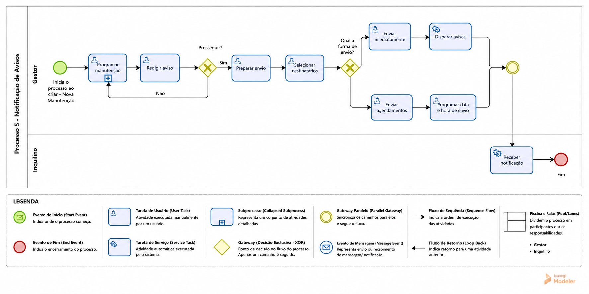

### 3.3.5 Processo 5 – Avisos

**Nome do Processo (UI):** Gestão de Avisos e Comunicações

**Alinhamento com as telas do UI (Wireframe)**

De acordo com o documento **`docs/ui/_ui.md`**, a gestão de avisos ocorre na **UI 3.6 – Tela de avisos (Fluxo do Gestor)**, que centraliza:

- lista de avisos cadastrados
- **título** e **descrição** do aviso
- **data de publicação**
- **ações** de gerenciamento
- botão **"Novo aviso"**

> Observação: o wireframe não detalha o conteúdo do modal/formulário de “Novo aviso”. Assim, este processo propõe um conjunto mínimo de campos coerentes com o que a UI exibe (título, descrição e data) e com as oportunidades de melhoria.

**Oportunidades de melhoria:**

  * **Templates pré-definidos:** Criar uma biblioteca de modelos de mensagens prontos ao acionar **"Novo aviso"** (ex.: falta de água, manutenção de elevador, dedetização), agilizando o trabalho do Gestor.
  * **Múltiplos Canais de Envio:** Além do aviso no painel, expandir a comunicação para disparos via e-mail/WhatsApp/SMS/notificações push, garantindo maior alcance.

---

#### Detalhamento das atividades (mapeado para UI)

### 1) Listar avisos (Tela de avisos – Gestor)

> **Alinhamento com UI:** corresponde à **UI 3.6 – Tela de avisos**.

**Objetivo:** permitir ao Gestor visualizar, criar e gerenciar avisos do condomínio.

| **Dados exibidos (lista/tabela)** | **Tipo** | **Observações** |
| --- | --- | --- |
| titulo_aviso | Texto | Somente leitura na listagem (equivalente ao “título” da UI). |
| descricao_aviso | Texto | Somente leitura na listagem (equivalente à “descrição” da UI). |
| data_publicacao | Data | Somente leitura (equivalente à “data de publicação”). |
| acoes | Botões/ícones | Ex.: editar / remover. |

| **Comandos** | **Destino** | **Tipo** |
| --- | --- | --- |
| Novo aviso | Atividade "Cadastrar aviso" | default |
| Editar (linha) | Atividade "Editar aviso" | default |
| Remover (linha) | Atividade "Remover aviso" | cancel |

---

### 2) Cadastrar aviso (iniciado por “Novo aviso”)

> **Alinhamento com UI:** ação **"Novo aviso"** na UI 3.6. Recomenda-se a abertura de um modal/formulário.

| **Campo** | **Tipo** | **Restrições** | **Valor default** |
| --- | --- | --- | --- |
| titulo_aviso | Caixa de texto | Obrigatório, máximo de 100 caracteres | |
| descricao_aviso | Área de texto | Obrigatório, mínimo de 20 caracteres | |
| data_publicacao | Data | Obrigatório (padrão: data atual) | Data atual |

| **Comandos** | **Destino** | **Tipo** |
| --- | --- | --- |
| Salvar | Retorna para "Listar avisos" com o aviso publicado | default |
| Cancelar | Retorna para "Listar avisos" sem alterações | cancel |

---

### 3) Editar aviso

> **Alinhamento com UI:** ação de edição na lista da UI 3.6.

| **Campo** | **Tipo** | **Restrições** | **Valor default** |
| --- | --- | --- | --- |
| titulo_aviso | Caixa de texto | Obrigatório, máximo de 100 caracteres | (pré-preenchido) |
| descricao_aviso | Área de texto | Obrigatório, mínimo de 20 caracteres | (pré-preenchido) |
| data_publicacao | Data | Obrigatório | (pré-preenchido) |

| **Comandos** | **Destino** | **Tipo** |
| --- | --- | --- |
| Salvar alterações | Retorna para "Listar avisos" com dados atualizados | default |
| Cancelar | Retorna para "Listar avisos" sem alterações | cancel |

---

### 4) Remover aviso

> **Alinhamento com UI:** ação de remoção na lista da UI 3.6, com confirmação.

| **Campo/Dado** | **Tipo** | **Restrições** | **Valor default** |
| --- | --- | --- | --- |
| aviso | Somente leitura | Exibe título do aviso a ser removido | |

| **Comandos** | **Destino** | **Tipo** |
| --- | --- | --- |
| Confirmar remoção | Retorna para "Listar avisos" sem o aviso removido | default |
| Cancelar | Retorna para "Listar avisos" sem alterações | cancel |

---

**Resultado esperado**

- Gestor consegue **criar, listar, editar e remover avisos** na **UI 3.6**.
- Lista sempre apresenta **título**, **descrição** e **data de publicação**.
