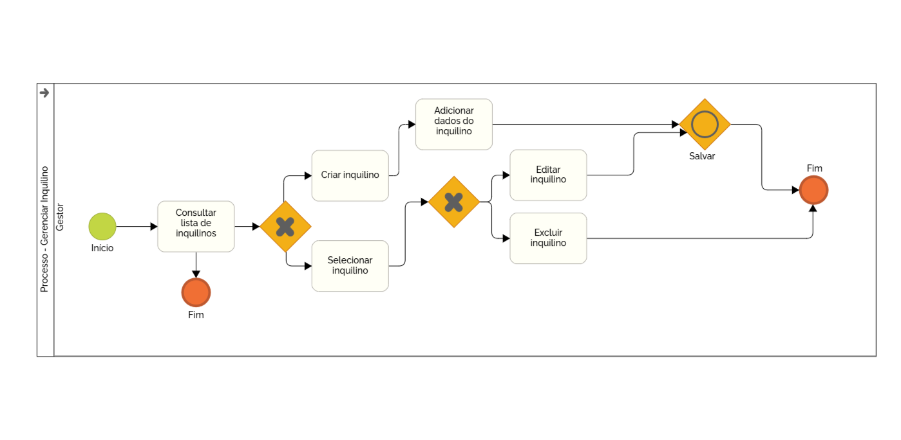

### 3.3.6 Processo 6 – Gerenciar Inquilinos

**Nome do Processo (UI):** Gerenciar Inquilinos (Gestor)

**Observação de alinhamento com UI:** Este processo descreve o fluxo de gerenciamento de inquilinos realizado pelo Gestor, englobando a listagem, criação, edição e exclusão de cadastros. O fluxo reflete as seguintes telas mapeadas (referência de UI):

- **UI 6.1 – Lista de inquilinos** (Consulta à lista de inquilinos cadastrados)
- **UI 6.2 – Criar inquilino** (Tela ou modal de adição de dados do novo inquilino)
- **UI 6.3 – Editar inquilino** (Tela ou modal de atualização de dados)
- **UI 6.4 – Excluir inquilino** (Confirmação de remoção)

> Importante: O diagrama estabelece a Consulta à lista de inquilinos como o ponto central de decisão, a partir do qual o Gestor pode optar por criar um novo registro ou selecionar um registro existente para edição ou exclusão.

**Oportunidades de melhoria:**

  * **Importação em lote:** Permitir que o Gestor importe uma lista de inquilinos via arquivo CSV/Excel para agilizar o cadastro inicial.
  * **Integração com unidades:** Vincular automaticamente o inquilino a um bloco/apartamento específico do condomínio.
  * **Notificação de boas-vindas:** Ao salvar um novo inquilino, enviar automaticamente um e-mail de boas-vindas com instruções de acesso (se houver portal do morador).

#### Detalhamento das atividades

**Consultar lista de inquilinos (Gestor)**

> **Alinhamento com UI:** Corresponde à "Lista de inquilinos" (UI 6.1), onde o Gestor visualiza todos os inquilinos e decide sua próxima ação. O processo pode ser encerrado diretamente nesta etapa.

| **Campo/Dado** | **Tipo** | **Restrições** | **Valor default** |
| --- | --- | --- | --- |
| termo_busca | Caixa de texto | Opcional | |
| inquilino_selecionado | Seleção em tabela/lista | Opcional (necessário para editar/excluir) | |

| **Comandos** | **Destino** | **Tipo** |
| --- | --- | --- |
| Criar inquilino | Atividades "Criar inquilino / Adicionar dados do inquilino" (UI 6.2) | default |
| Selecionar inquilino | Bifurcação para "Editar inquilino" ou "Excluir inquilino" | default |
| Sair/Fechar | Fim do processo | cancel |

---

**Criar inquilino / Adicionar dados do inquilino (Gestor)**

> **Alinhamento com UI:** Modal ou página "Criar inquilino" (UI 6.2). Após acessar a opção de criar, o Gestor deve preencher os dados do novo morador.

| **Campo** | **Tipo** | **Restrições** | **Valor default** |
| --- | --- | --- | --- |
| nome | Caixa de texto | Obrigatório, máximo de 100 caracteres | |
| email | Caixa de texto | Obrigatório, formato de e-mail | |
| telefone | Caixa de texto | Opcional, formato numérico/máscara | |
| unidade | Caixa de seleção | Obrigatório | |

| **Comandos** | **Destino** | **Tipo** |
| --- | --- | --- |
| Salvar | Atividade "Salvar", finalizando o processo e retornando à lista atualizada | default |
| Cancelar | Retorna para a "Lista de inquilinos" (UI 6.1) sem salvar | cancel |

---

**Selecionar inquilino > Editar inquilino (Gestor)**

> **Alinhamento com UI:** Após selecionar um inquilino, o Gestor acessa o modal/página de "Editar inquilino" (UI 6.3) para alterar dados existentes.

| **Campo** | **Tipo** | **Restrições** | **Valor default** |
| --- | --- | --- | --- |
| nome | Caixa de texto | Obrigatório, máximo de 100 caracteres | (pré-preenchido) |
| email | Caixa de texto | Obrigatório, formato de e-mail | (pré-preenchido) |
| telefone | Caixa de texto | Opcional, formato numérico/máscara | (pré-preenchido) |
| unidade | Caixa de seleção | Obrigatório | (pré-preenchido) |

| **Comandos** | **Destino** | **Tipo** |
| --- | --- | --- |
| Salvar | Atividade "Salvar", finalizando o processo e retornando à lista atualizada | default |
| Cancelar | Retorna para a "Lista de inquilinos" (UI 6.1) sem salvar alterações | cancel |

---

**Selecionar inquilino > Excluir inquilino (Gestor)**

> **Alinhamento com UI:** Após selecionar um inquilino, o Gestor escolhe a ação de exclusão, disparando a "Confirmação de remoção" (UI 6.4).

| **Campo/Dado** | **Tipo** | **Restrições** | **Valor default** |
| --- | --- | --- | --- |
| dados_inquilino | Somente leitura | Exibir nome/unidade do inquilino selecionado para conferência | |

| **Comandos** | **Destino** | **Tipo** |
| --- | --- | --- |
| Confirmar exclusão | Remove o inquilino e direciona para o Fim do processo (retornando à lista) | default |
| Cancelar | Retorna para a "Lista de inquilinos" (UI 6.1) sem alterações | cancel |

---

**Resultado esperado**

- Novo inquilino cadastrado com sucesso e exibido na lista geral.
- Dados de um inquilino existente atualizados corretamente (após edição e salvamento).
- Inquilino removido permanentemente da lista (após exclusão).

Em todas as ações finalizadas com sucesso, o sistema retorna a lista atualizada para o Gestor.
