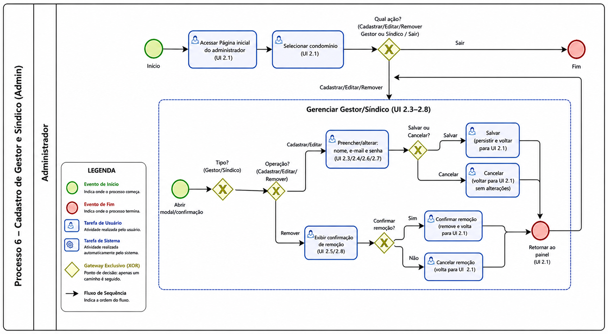
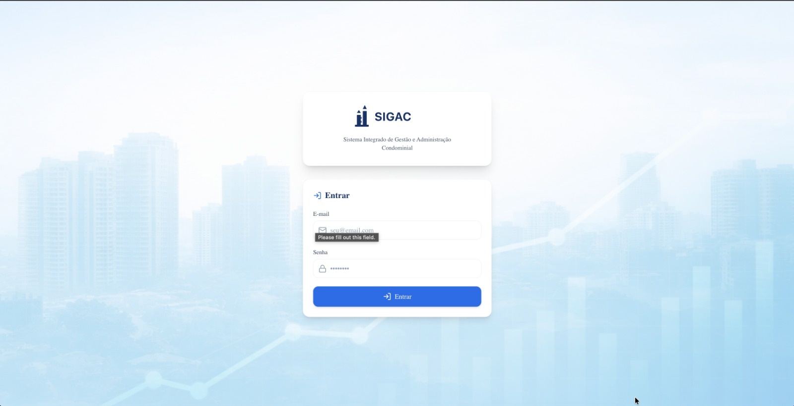
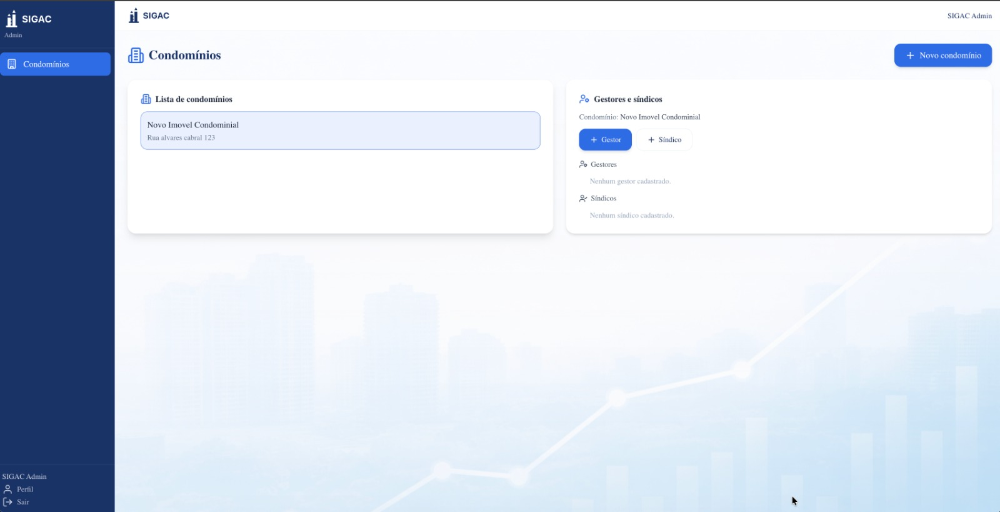
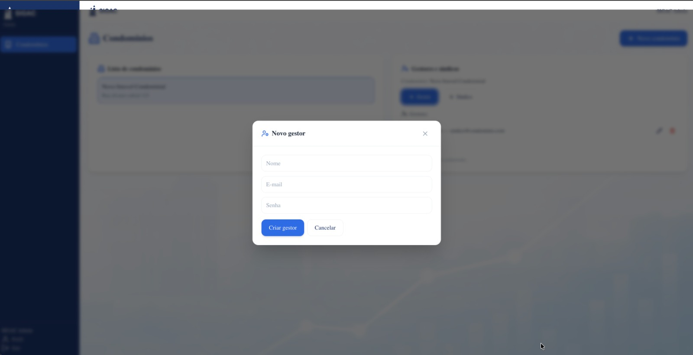
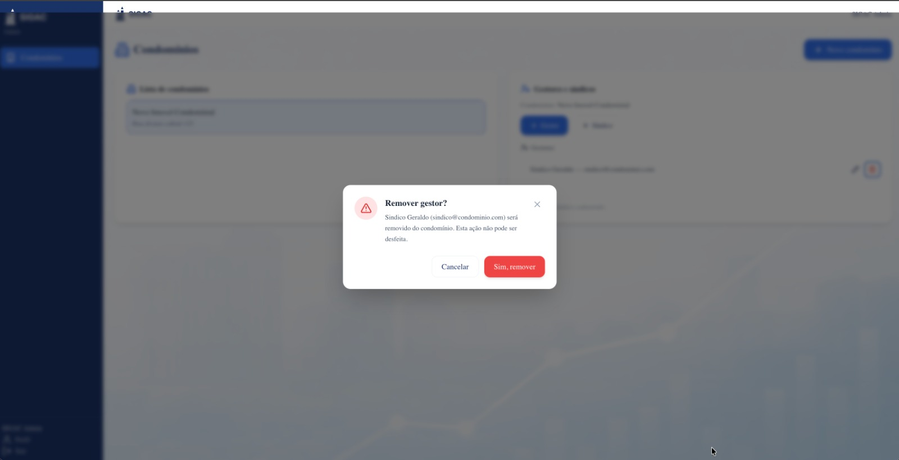
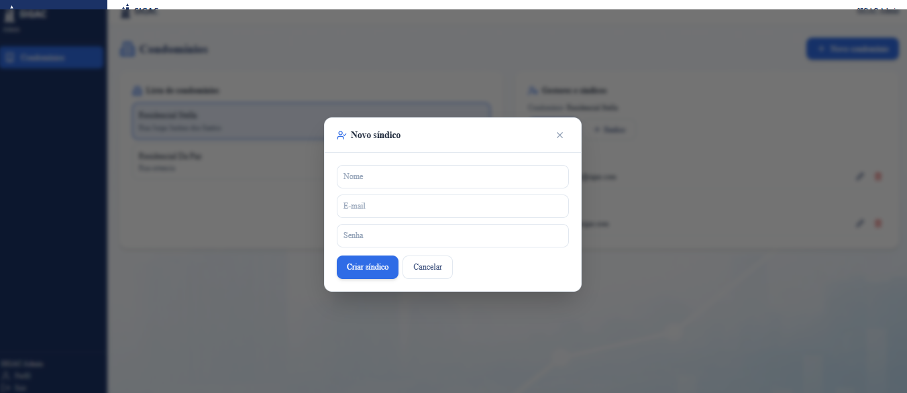

### 3.3.6 Processo 6 – Cadastro de Gestor e Síndico

**Nome do Processo (UI):** Cadastro de Gestor e Síndico (Admin)

**Observação de alinhamento com UI:** Este processo foi ajustado para refletir exatamente o que está descrito no wireframe `docs/ui/_ui.md`, seção **2. Fluxo do Admin**, nas telas:

- **UI 2.1 – Página inicial do administrador** (lista de condomínios + painel de gestores e síndicos vinculados ao condomínio selecionado)
- **UI 2.3 – Cadastro de novo gestor** (modal)
- **UI 2.4 – Edição de gestor** (modal)
- **UI 2.5 – Remoção de gestor** (confirmação)
- **UI 2.6 – Cadastro de novo síndico** (modal)
- **UI 2.7 – Edição de síndico** (modal)
- **UI 2.8 – Remoção de síndico** (confirmação)

> Importante: conforme o wireframe, **Gestor** e **Síndico** possuem **fluxos separados**, porém muito similares (nome, e-mail e senha).

**Oportunidades de melhoria:**

  * **Convite por e-mail com ativação:** Em vez de cadastrar senha manualmente, enviar convite (link com expiração) para o Gestor/Síndico definir a própria senha.
  * **Validação e unicidade de e-mail:** Bloquear cadastro duplicado e sugerir reaproveitar usuário já existente, caso o e-mail já esteja no sistema.
  * **Papéis e permissões:** Evoluir de apenas “Gestor” e “Síndico” para permissões configuráveis.

#### Detalhamento das atividades

**Selecionar condomínio (Admin)**

> **Alinhamento com UI:** Corresponde à **"Página inicial do administrador"** (UI 2.1), onde o Admin seleciona um condomínio para gerenciar as pessoas associadas.

| **Campo/Dado** | **Tipo** | **Restrições** | **Valor default** |
| --- | --- | --- | --- |
| condominio_selecionado | Seleção única (lista) | Obrigatório | |

| **Comandos** | **Destino** | **Tipo** |
| --- | --- | --- |
| Cadastrar novo condomínio | Processo 1 – Cadastro de condomínios (UI 2.2) | default |
| Cadastrar novo gestor | Atividade "Cadastrar novo gestor" | default |
| Editar gestor | Atividade "Editar gestor" | default |
| Remover gestor | Atividade "Remover gestor" | cancel |
| Cadastrar novo síndico | Atividade "Cadastrar novo síndico" | default |
| Editar síndico | Atividade "Editar síndico" | default |
| Remover síndico | Atividade "Remover síndico" | cancel |

---

**Cadastrar novo gestor (Admin)**

> **Alinhamento com UI:** Modal **"Cadastro de novo gestor"** (UI 2.3).

| **Campo** | **Tipo** | **Restrições** | **Valor default** |
| --- | --- | --- | --- |
| nome | Caixa de texto | Obrigatório, máximo de 100 caracteres | |
| email | Caixa de texto | Obrigatório, formato de e-mail | |
| senha | Caixa de texto (senha) | Obrigatório, mínimo de 8 caracteres | |

| **Comandos** | **Destino** | **Tipo** |
| --- | --- | --- |
| Salvar | Retorna para a "Página inicial do administrador" (UI 2.1) com gestor incluído no painel | default |
| Cancelar | Retorna para a "Página inicial do administrador" (UI 2.1) sem alterações | cancel |

---

**Editar gestor (Admin)**

> **Alinhamento com UI:** Modal **"Edição de gestor"** (UI 2.4).

| **Campo** | **Tipo** | **Restrições** | **Valor default** |
| --- | --- | --- | --- |
| nome | Caixa de texto | Obrigatório, máximo de 100 caracteres | (pré-preenchido) |
| email | Caixa de texto | Obrigatório, formato de e-mail | (pré-preenchido) |
| senha | Caixa de texto (senha) | Opcional (somente se desejar alterar) | |

| **Comandos** | **Destino** | **Tipo** |
| --- | --- | --- |
| Salvar alterações | Retorna para a "Página inicial do administrador" (UI 2.1) com dados atualizados | default |
| Cancelar | Retorna para a "Página inicial do administrador" (UI 2.1) sem alterações | cancel |

---

**Remover gestor (Admin)**

> **Alinhamento com UI:** Confirmação **"Remoção de gestor"** (UI 2.5).

| **Campo/Dado** | **Tipo** | **Restrições** | **Valor default** |
| --- | --- | --- | --- |
| gestor | Somente leitura | Exibir nome/e-mail do gestor selecionado | |

| **Comandos** | **Destino** | **Tipo** |
| --- | --- | --- |
| Confirmar remoção | Retorna para UI 2.1 com gestor removido do painel | default |
| Cancelar | Retorna para UI 2.1 sem alterações | cancel |

---

**Cadastrar novo síndico (Admin)**

> **Alinhamento com UI:** Modal **"Cadastro de novo síndico"** (UI 2.6).

| **Campo** | **Tipo** | **Restrições** | **Valor default** |
| --- | --- | --- | --- |
| nome | Caixa de texto | Obrigatório, máximo de 100 caracteres | |
| email | Caixa de texto | Obrigatório, formato de e-mail | |
| senha | Caixa de texto (senha) | Obrigatório, mínimo de 8 caracteres | |

| **Comandos** | **Destino** | **Tipo** |
| --- | --- | --- |
| Salvar | Retorna para a "Página inicial do administrador" (UI 2.1) com síndico incluído no painel | default |
| Cancelar | Retorna para a "Página inicial do administrador" (UI 2.1) sem alterações | cancel |

---

**Editar síndico (Admin)**

> **Alinhamento com UI:** Modal **"Edição de síndico"** (UI 2.7).

| **Campo** | **Tipo** | **Restrições** | **Valor default** |
| --- | --- | --- | --- |
| nome | Caixa de texto | Obrigatório, máximo de 100 caracteres | (pré-preenchido) |
| email | Caixa de texto | Obrigatório, formato de e-mail | (pré-preenchido) |
| senha | Caixa de texto (senha) | Opcional (somente se desejar alterar) | |

| **Comandos** | **Destino** | **Tipo** |
| --- | --- | --- |
| Salvar alterações | Retorna para a "Página inicial do administrador" (UI 2.1) com dados atualizados | default |
| Cancelar | Retorna para a "Página inicial do administrador" (UI 2.1) sem alterações | cancel |

---

**Remover síndico (Admin)**

> **Alinhamento com UI:** Confirmação **"Remoção de síndico"** (UI 2.8).

| **Campo/Dado** | **Tipo** | **Restrições** | **Valor default** |
| --- | --- | --- | --- |
| sindico | Somente leitura | Exibir nome/e-mail do síndico selecionado | |

| **Comandos** | **Destino** | **Tipo** |
| --- | --- | --- |
| Confirmar remoção | Retorna para UI 2.1 com síndico removido do painel | default |
| Cancelar | Retorna para UI 2.1 sem alterações | cancel |

---

**Resultado esperado**

- Gestor e/ou Síndico cadastrados e vinculados ao condomínio selecionado.
- Alterações (edição/remoção) refletidas no painel da **UI 2.1**.

