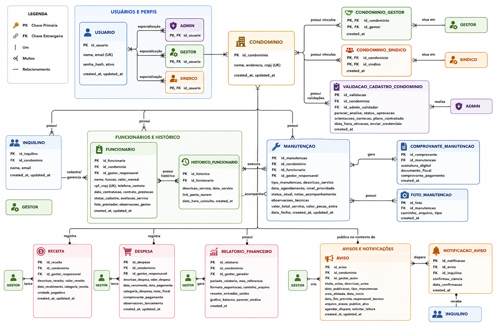

## 4. Projeto da solução

### 4.1. Modelo de dados

_Abaixo segue o modelo de dados por meio de um modelo relacional revisado para contemplar os processos 1, 2, 3, 4, 5 e 6, alinhado aos documentos de processo e ao wireframe da aplicação._



#### Modelo relacional revisado (SQL)

```sql
-- =============================================
-- MODELO DE DADOS - SIGAC
-- Revisado conforme Processos 1, 2, 3, 4, 5 e 6
-- =============================================

-- -----------------------------
-- USUÁRIOS BASE
-- -----------------------------
CREATE TABLE usuario (
    id_usuario       INT PRIMARY KEY AUTO_INCREMENT,
    nome             VARCHAR(100) NOT NULL,
    email            VARCHAR(150) NOT NULL UNIQUE,
    senha_hash       VARCHAR(255) NOT NULL,
    ativo            BOOLEAN NOT NULL DEFAULT TRUE,
    created_at       DATETIME NOT NULL DEFAULT CURRENT_TIMESTAMP,
    updated_at       DATETIME NULL DEFAULT NULL
);

CREATE TABLE admin (
    id_usuario       INT PRIMARY KEY,
    FOREIGN KEY (id_usuario) REFERENCES usuario(id_usuario)
);

CREATE TABLE gestor (
    id_usuario       INT PRIMARY KEY,
    FOREIGN KEY (id_usuario) REFERENCES usuario(id_usuario)
);

CREATE TABLE sindico (
    id_usuario       INT PRIMARY KEY,
    FOREIGN KEY (id_usuario) REFERENCES usuario(id_usuario)
);

-- -----------------------------
-- CONDOMÍNIOS (Processo 1)
-- -----------------------------
CREATE TABLE condominio (
    id_condominio        INT PRIMARY KEY AUTO_INCREMENT,
    nome                 VARCHAR(100) NOT NULL,
    endereco             VARCHAR(200) NOT NULL,
    cnpj                 VARCHAR(18) NOT NULL UNIQUE,
    created_at           DATETIME NOT NULL DEFAULT CURRENT_TIMESTAMP,
    updated_at           DATETIME NULL DEFAULT NULL
);

-- Vínculo de gestores ao condomínio (Processo 6)
CREATE TABLE condominio_gestor (
    id_condominio        INT NOT NULL,
    id_gestor            INT NOT NULL,
    created_at           DATETIME NOT NULL DEFAULT CURRENT_TIMESTAMP,
    PRIMARY KEY (id_condominio, id_gestor),
    FOREIGN KEY (id_condominio) REFERENCES condominio(id_condominio),
    FOREIGN KEY (id_gestor) REFERENCES gestor(id_usuario)
);

-- Vínculo de síndicos ao condomínio (Processo 6)
CREATE TABLE condominio_sindico (
    id_condominio        INT NOT NULL,
    id_sindico           INT NOT NULL,
    created_at           DATETIME NOT NULL DEFAULT CURRENT_TIMESTAMP,
    PRIMARY KEY (id_condominio, id_sindico),
    FOREIGN KEY (id_condominio) REFERENCES condominio(id_condominio),
    FOREIGN KEY (id_sindico) REFERENCES sindico(id_usuario)
);

-- Validação/ativação de cadastro (Processo 1 - relatório detalhado)
CREATE TABLE validacao_cadastro_condominio (
    id_validacao         INT PRIMARY KEY AUTO_INCREMENT,
    id_condominio        INT NOT NULL,
    id_admin_validador   INT NOT NULL,
    parecer_analise      TEXT NULL,
    status_aprovacao     ENUM('Aprovado', 'Rejeitado') NOT NULL,
    orientacoes_correcao TEXT NULL,
    plano_contratado     ENUM('Basico', 'Intermediario', 'Pro') NULL,
    data_hora_ativacao   DATETIME NULL,
    enviar_credenciais   BOOLEAN NOT NULL DEFAULT TRUE,
    created_at           DATETIME NOT NULL DEFAULT CURRENT_TIMESTAMP,
    FOREIGN KEY (id_condominio) REFERENCES condominio(id_condominio),
    FOREIGN KEY (id_admin_validador) REFERENCES admin(id_usuario)
);

-- -----------------------------
-- INQUILINOS
-- -----------------------------
CREATE TABLE inquilino (
    id_inquilino         INT PRIMARY KEY AUTO_INCREMENT,
    id_condominio        INT NOT NULL,
    nome                 VARCHAR(100) NOT NULL,
    email                VARCHAR(150) NOT NULL,
    created_at           DATETIME NOT NULL DEFAULT CURRENT_TIMESTAMP,
    updated_at           DATETIME NULL DEFAULT NULL,
    UNIQUE (id_condominio, email),
    FOREIGN KEY (id_condominio) REFERENCES condominio(id_condominio)
);

-- -----------------------------
-- FUNCIONÁRIOS / PRESTADORES (Processo 2)
-- -----------------------------
CREATE TABLE funcionario (
    id_funcionario               INT PRIMARY KEY AUTO_INCREMENT,
    id_condominio               INT NOT NULL,
    id_gestor_responsavel       INT NOT NULL,
    nome                        VARCHAR(100) NOT NULL,
    funcao                      VARCHAR(50) NOT NULL,
    valor_mensal                DECIMAL(10,2) NOT NULL,
    cpf_cnpj                    VARCHAR(18) NULL UNIQUE,
    telefone_contato            VARCHAR(20) NULL,
    data_contratacao            DATE NULL,
    contrato_prestacao          VARCHAR(500) NULL,
    status_cadastro             ENUM('Ativo', 'Inativo', 'Suspenso') NOT NULL DEFAULT 'Ativo',
    avaliacao_servico           INT NULL,
    foto_prestador              VARCHAR(500) NULL,
    observacoes_gestor          TEXT NULL,
    created_at                  DATETIME NOT NULL DEFAULT CURRENT_TIMESTAMP,
    updated_at                  DATETIME NULL DEFAULT NULL,
    CHECK (valor_mensal > 0),
    CHECK (avaliacao_servico IS NULL OR avaliacao_servico BETWEEN 1 AND 5),
    FOREIGN KEY (id_condominio) REFERENCES condominio(id_condominio),
    FOREIGN KEY (id_gestor_responsavel) REFERENCES gestor(id_usuario)
);

CREATE TABLE historico_funcionario (
    id_historico                INT PRIMARY KEY AUTO_INCREMENT,
    id_funcionario              INT NOT NULL,
    descricao_servico           TEXT NOT NULL,
    data_servico                DATE NOT NULL,
    link_pasta_nuvem            VARCHAR(500) NULL,
    data_hora_consulta          DATETIME NULL,
    created_at                  DATETIME NOT NULL DEFAULT CURRENT_TIMESTAMP,
    FOREIGN KEY (id_funcionario) REFERENCES funcionario(id_funcionario)
);

-- -----------------------------
-- MANUTENÇÕES (Processo 3)
-- -----------------------------
CREATE TABLE manutencao (
    id_manutencao               INT PRIMARY KEY AUTO_INCREMENT,
    id_condominio               INT NOT NULL,
    id_funcionario              INT NOT NULL,
    id_gestor_responsavel       INT NOT NULL,
    tipo_manutencao             VARCHAR(50) NOT NULL,
    descricao_servico           TEXT NOT NULL,
    data_agendamento            DATETIME NOT NULL,
    nivel_prioridade            ENUM('Baixa', 'Media', 'Alta', 'Urgente') NOT NULL DEFAULT 'Media',
    status_atual                ENUM('Em andamento', 'Aguarda peca', 'Finalizado') NOT NULL DEFAULT 'Em andamento',
    notas_acompanhamento        TEXT NULL,
    observacoes_tecnicas        TEXT NULL,
    valor_total_servico         DECIMAL(10,2) NULL,
    valor_pecas_extra           DECIMAL(10,2) NOT NULL DEFAULT 0.00,
    data_fecho                  DATETIME NULL,
    created_at                  DATETIME NOT NULL DEFAULT CURRENT_TIMESTAMP,
    updated_at                  DATETIME NULL DEFAULT NULL,
    CHECK (valor_pecas_extra >= 0),
    CHECK (valor_total_servico IS NULL OR valor_total_servico >= 0),
    FOREIGN KEY (id_condominio) REFERENCES condominio(id_condominio),
    FOREIGN KEY (id_funcionario) REFERENCES funcionario(id_funcionario),
    FOREIGN KEY (id_gestor_responsavel) REFERENCES gestor(id_usuario)
);

CREATE TABLE comprovante_manutencao (
    id_comprovante              INT PRIMARY KEY AUTO_INCREMENT,
    id_manutencao               INT NOT NULL,
    assinatura_digital          VARCHAR(500) NULL,
    documento_fiscal            VARCHAR(500) NOT NULL,
    comprovante_pagamento       VARCHAR(500) NULL,
    created_at                  DATETIME NOT NULL DEFAULT CURRENT_TIMESTAMP,
    FOREIGN KEY (id_manutencao) REFERENCES manutencao(id_manutencao)
);

CREATE TABLE foto_manutencao (
    id_foto                     INT PRIMARY KEY AUTO_INCREMENT,
    id_manutencao               INT NOT NULL,
    caminho_arquivo             VARCHAR(500) NOT NULL,
    tipo                        ENUM('antes', 'depois') NOT NULL,
    created_at                  DATETIME NOT NULL DEFAULT CURRENT_TIMESTAMP,
    FOREIGN KEY (id_manutencao) REFERENCES manutencao(id_manutencao)
);

-- -----------------------------
-- GESTÃO FINANCEIRA (Processo 4)
-- -----------------------------
CREATE TABLE receita (
    id_receita                  INT PRIMARY KEY AUTO_INCREMENT,
    id_condominio               INT NOT NULL,
    id_gestor_responsavel       INT NOT NULL,
    descricao_receita           VARCHAR(100) NOT NULL,
    valor_receita               DECIMAL(10,2) NOT NULL,
    data_recebimento            DATE NOT NULL,
    categoria_receita           VARCHAR(50) NOT NULL,
    unidade_pagadora            VARCHAR(50) NOT NULL,
    created_at                  DATETIME NOT NULL DEFAULT CURRENT_TIMESTAMP,
    updated_at                  DATETIME NULL DEFAULT NULL,
    CHECK (valor_receita > 0),
    FOREIGN KEY (id_condominio) REFERENCES condominio(id_condominio),
    FOREIGN KEY (id_gestor_responsavel) REFERENCES gestor(id_usuario)
);

CREATE TABLE despesa (
    id_despesa                  INT PRIMARY KEY AUTO_INCREMENT,
    id_condominio               INT NOT NULL,
    id_gestor_responsavel       INT NOT NULL,
    descricao_despesa           VARCHAR(100) NOT NULL,
    valor_despesa               DECIMAL(10,2) NOT NULL,
    data_vencimento             DATE NOT NULL,
    data_pagamento              DATE NULL,
    categoria_despesa           VARCHAR(50) NOT NULL,
    nota_fiscal                 VARCHAR(500) NULL,
    comprovante_pagamento       VARCHAR(500) NULL,
    observacoes_lancamento      TEXT NULL,
    created_at                  DATETIME NOT NULL DEFAULT CURRENT_TIMESTAMP,
    updated_at                  DATETIME NULL DEFAULT NULL,
    CHECK (valor_despesa > 0),
    FOREIGN KEY (id_condominio) REFERENCES condominio(id_condominio),
    FOREIGN KEY (id_gestor_responsavel) REFERENCES gestor(id_usuario)
);

CREATE TABLE relatorio_financeiro (
    id_relatorio                INT PRIMARY KEY AUTO_INCREMENT,
    id_condominio               INT NOT NULL,
    id_gestor_gerador           INT NOT NULL,
    periodo_relatorio           ENUM('Mensal', 'Trimestral', 'Anual') NOT NULL DEFAULT 'Mensal',
    mes_referencia              DATE NOT NULL,
    formato_exportacao          VARCHAR(20) NOT NULL DEFAULT 'PDF',
    caminho_arquivo             VARCHAR(500) NULL,
    resumo_entradas_saidas      TEXT NULL,
    grafico_balanco             VARCHAR(500) NULL,
    parecer_sindico             TEXT NULL,
    created_at                  DATETIME NOT NULL DEFAULT CURRENT_TIMESTAMP,
    FOREIGN KEY (id_condominio) REFERENCES condominio(id_condominio),
    FOREIGN KEY (id_gestor_gerador) REFERENCES gestor(id_usuario)
);

-- -----------------------------
-- AVISOS E COMUNICAÇÕES (Processo 5)
-- -----------------------------
CREATE TABLE aviso (
    id_aviso                    INT PRIMARY KEY AUTO_INCREMENT,
    id_condominio               INT NOT NULL,
    id_gestor_autor             INT NOT NULL,
    titulo_aviso                VARCHAR(100) NOT NULL,
    descricao_aviso             TEXT NOT NULL,
    data_publicacao             DATE NOT NULL,
    tipo_manutencao             VARCHAR(50) NULL,
    area_afetada                VARCHAR(200) NULL,
    data_inicio                 DATETIME NULL,
    data_fim_prevista           DATETIME NULL,
    responsavel_tecnico         VARCHAR(100) NULL,
    arquivo_anexo               VARCHAR(500) NULL,
    publico_alvo                VARCHAR(50) NULL,
    agendar_disparo             DATETIME NULL,
    solicitar_leitura           BOOLEAN NOT NULL DEFAULT FALSE,
    created_at                  DATETIME NOT NULL DEFAULT CURRENT_TIMESTAMP,
    updated_at                  DATETIME NULL DEFAULT NULL,
    FOREIGN KEY (id_condominio) REFERENCES condominio(id_condominio),
    FOREIGN KEY (id_gestor_autor) REFERENCES gestor(id_usuario)
);

CREATE TABLE notificacao_aviso (
    id_notificacao              INT PRIMARY KEY AUTO_INCREMENT,
    id_aviso                    INT NOT NULL,
    id_inquilino                INT NOT NULL,
    confirmou_ciencia           BOOLEAN NOT NULL DEFAULT FALSE,
    data_confirmacao            DATETIME NULL,
    created_at                  DATETIME NOT NULL DEFAULT CURRENT_TIMESTAMP,
    UNIQUE (id_aviso, id_inquilino),
    FOREIGN KEY (id_aviso) REFERENCES aviso(id_aviso),
    FOREIGN KEY (id_inquilino) REFERENCES inquilino(id_inquilino)
);
```

#### Revisão do alinhamento por processo

- **Processo 1 – Cadastro de Condomínios**: modelado em `condominio` e `validacao_cadastro_condominio`, com campos de cadastro, validação, correção e ativação.
- **Processo 2 – Cadastro de Funcionários**: ajustado para o que a UI mostra de fato, com `funcionario` contendo `nome`, `funcao` e `valor_mensal`; os campos extras do relatório detalhado foram mantidos como opcionais para cobrir o histórico de prestadores.
- **Processo 3 – Gestão de Manutenção**: `manutencao`, `comprovante_manutencao` e `foto_manutencao` cobrem criação, atualização, comprovantes, imagens e fechamento.
- **Processo 4 – Gestão Financeira**: `receita`, `despesa` e `relatorio_financeiro` suportam lançamentos, anexos e emissão/visualização de relatórios.
- **Processo 5 – Gestão de Avisos**: `aviso` e `notificacao_aviso` suportam criação, publicação, envio e confirmação de ciência.
- **Processo 6 – Cadastro de Gestor e Síndico**: os vínculos corretos entre pessoas e condomínio foram normalizados com `condominio_gestor` e `condominio_sindico`, evitando limitar o condomínio a um único gestor ou síndico fixo.

### 4.2. Tecnologias

| **Dimensão**   | **Tecnologia**  |
| ---            | ---             |
| SGBD           | MySQL           |
| Front end      | React           |
| Back end       | Java SpringBoot |
| Deploy         | Github Pages    |
