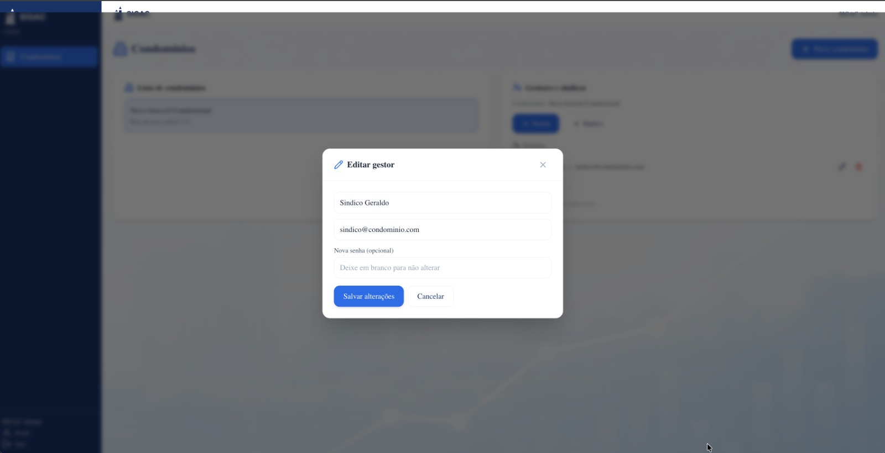
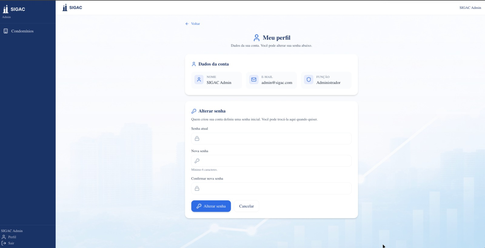
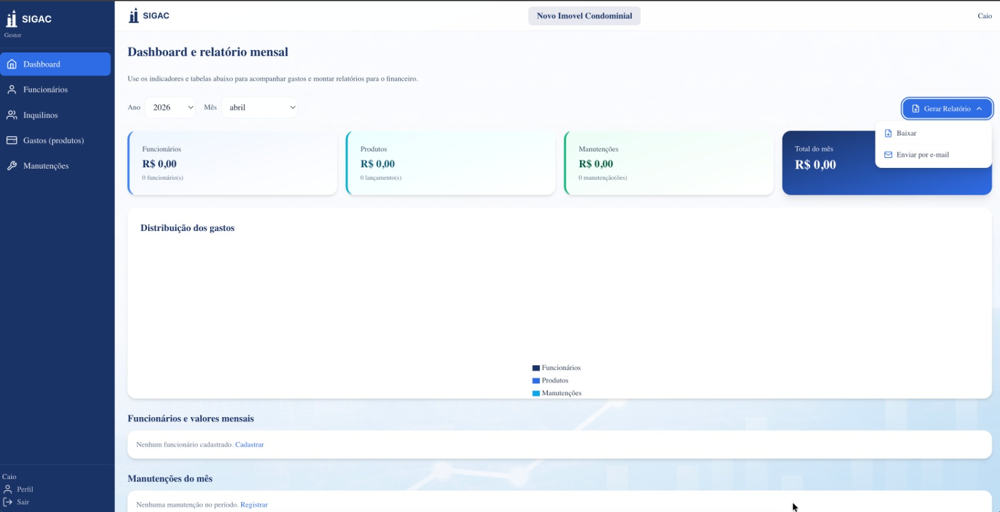
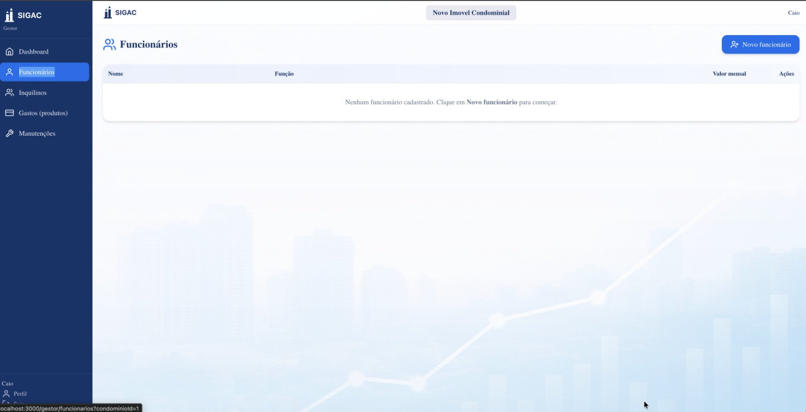
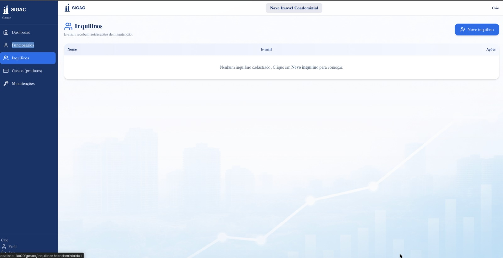
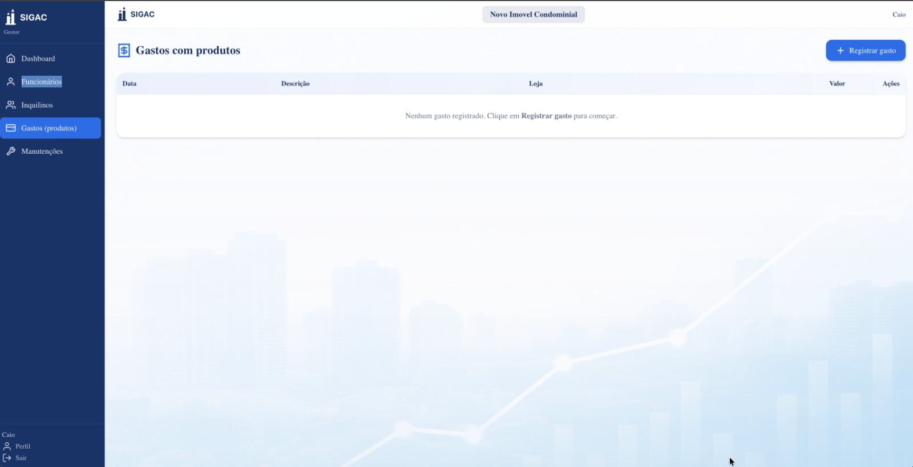
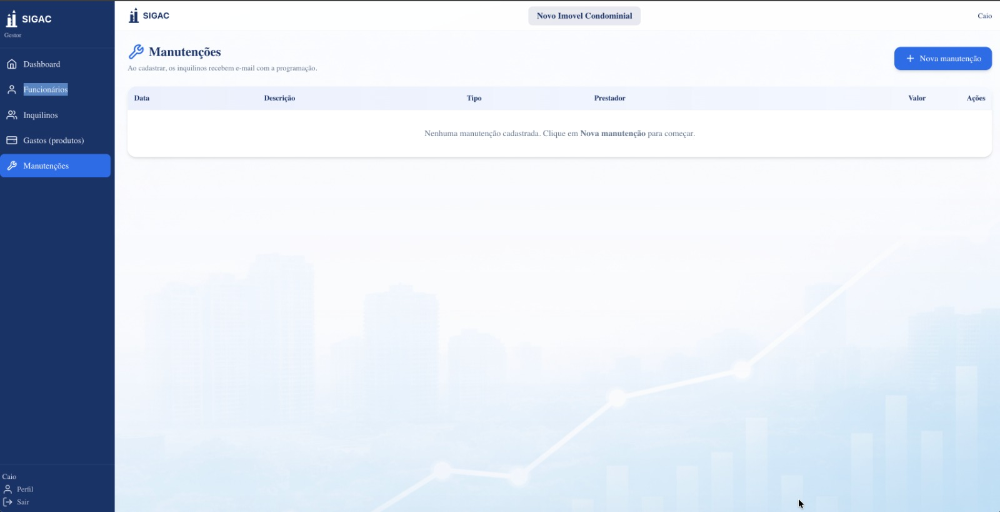
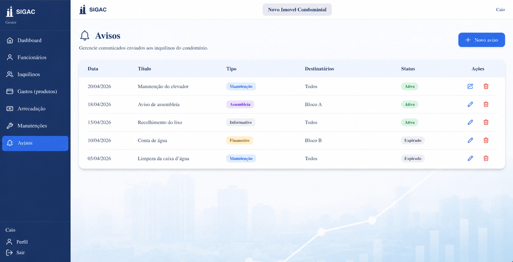
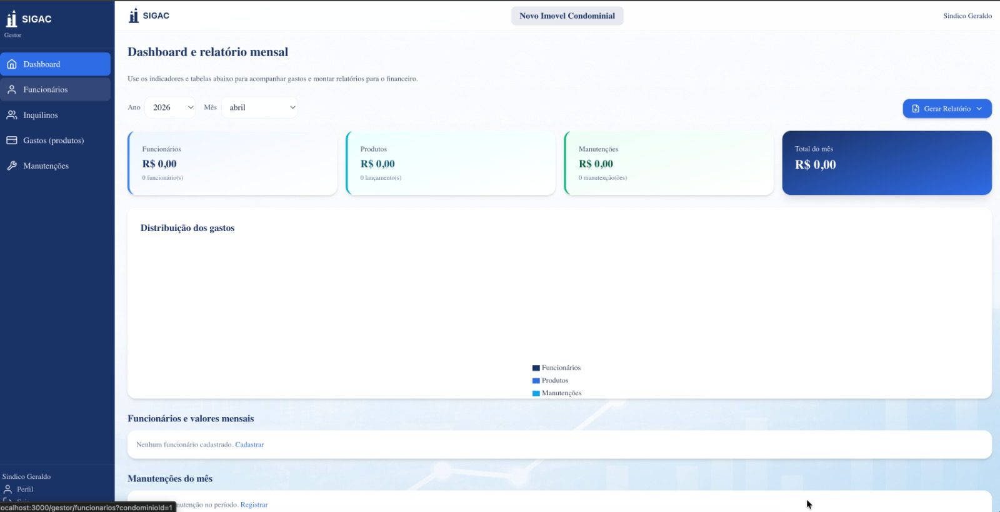

# UI/Wireframe Detalhado

Este documento detalha as telas do wireframe da interface do SIGAC.
O objetivo aqui e apresentar visualmente o fluxo da aplicacao, destacando o papel de cada tela dentro da navegacao do sistema.

Os fluxos estao organizados na seguinte ordem:

1. Login
2. Admin
3. Gestor
4. Sindico
5. Gestao Financeira

## 1. Fluxo de Login

### 1.1 Tela de entrada no sistema

Esta e a porta de acesso ao SIGAC. A tela apresenta o logotipo do sistema, o titulo institucional e um formulario simples com os campos de e-mail e senha. A acao principal e o botao de entrar.

Essa tela representa o inicio da jornada do usuario, permitindo o acesso ao sistema conforme o perfil autenticado.

## 2. Fluxo do Admin

O fluxo do administrador concentra o gerenciamento estrutural do sistema, principalmente o cadastro de condominios e a vinculacao de gestores e sindicos.

### 2.1 Pagina inicial do administrador

Esta tela mostra a visao principal do perfil administrador. A interface esta dividida em duas areas principais:

- lista de condominios cadastrados
- painel de gestores e sindicos vinculados ao condominio selecionado

O administrador pode selecionar um condominio e, a partir disso, visualizar quem esta associado a ele. Tambem existe o botao para cadastrar um novo condominio.

### 2.2 Criacao de condominio

Ao acionar o cadastro de um novo condominio, o sistema abre uma janela modal com os campos principais para registro:

- nome
- endereco
- CNPJ

Essa tela representa a etapa de criacao de uma nova unidade condominial dentro do sistema.

### 2.3 Cadastro de novo gestor

Com um condominio selecionado, o administrador pode cadastrar um novo gestor. A tela aparece em modal e solicita:

- nome
- e-mail
- senha

Esse fluxo e usado para conceder acesso operacional ao condominio.

### 2.4 Edicao de gestor

Esta tela permite atualizar os dados de um gestor ja cadastrado. O modal apresenta os campos preenchidos previamente e possibilita:

- alterar nome
- alterar e-mail
- definir nova senha opcionalmente

O objetivo e manter os dados de acesso atualizados sem precisar recriar o usuario.

### 2.5 Remocao de gestor

Ao remover um gestor, o sistema exibe uma confirmacao de seguranca. A mensagem deixa claro que a acao nao pode ser desfeita.

Essa tela reforca a necessidade de confirmacao antes da exclusao de um vinculo administrativo.

### 2.6 Cadastro de novo sindico

Com um condominio selecionado, o administrador pode cadastrar um novo sindico. A tela aparece em modal e solicita:

- nome
- e-mail
- senha

Esse fluxo e usado para conceder acesso de supervisao ao condominio.

### 2.7 Edicao de sindico

Esta tela permite atualizar os dados de um sindico ja cadastrado. O modal apresenta os campos preenchidos previamente e possibilita:

- alterar nome
- alterar e-mail
- definir nova senha opcionalmente

O objetivo e manter os dados de acesso atualizados sem precisar recriar o usuario.

### 2.8 Remocao de sindico

Ao remover um sindico, o sistema exibe uma confirmacao de seguranca. A mensagem deixa claro que a acao nao pode ser desfeita.

Essa tela reforca a necessidade de confirmacao antes da exclusao de um vinculo administrativo.

### 2.9 Perfil do administrador

Esta tela apresenta os dados da conta logada e permite a troca de senha. O usuario visualiza:

- nome
- e-mail
- funcao

Na mesma pagina existe o formulario para alterar senha atual, informar a nova senha e confirmar a alteracao.

## 3. Fluxo do Gestor

O fluxo do gestor e voltado para o acompanhamento financeiro e operacional do condominio, com foco em funcionarios, inquilinos, gastos e manutencoes.

### 3.1 Dashboard e relatorio mensal

Esta e a tela principal do gestor. Ela concentra indicadores do mes e a visao resumida do funcionamento do condominio.

Os principais elementos exibidos sao:

- filtros de ano e mes
- cards com valores de funcionarios, produtos e manutencoes
- total consolidado do mes
- area destinada a distribuicao dos gastos
- secoes resumidas de funcionarios e manutencoes do periodo
- acao para gerar relatorio, com opcoes de baixar ou enviar por e-mail

Essa tela representa o ponto central de consulta e acompanhamento do condominio.

### 3.2 Tela de funcionarios

Essa tela organiza o cadastro de funcionarios do condominio em formato de tabela. A estrutura evidencia:

- nome
- funcao
- valor mensal
- acoes

Tambem existe o botao para cadastrar um novo funcionario, indicando o fluxo de manutencao dos registros da equipe.

### 3.3 Tela de inquilinos

Esta tela lista os inquilinos cadastrados e destaca que os e-mails cadastrados recebem notificacoes de manutencao.

Os dados organizados na tabela sao:

- nome
- e-mail
- acoes

O botao de novo inquilino inicia o fluxo de cadastro.

### 3.4 Tela de gastos com produtos

Esta tela concentra os gastos recorrentes ou pontuais com produtos. Os registros sao exibidos em tabela com os campos:

- data
- descricao
- loja
- valor
- acoes

O botao de registrar gasto representa a entrada de novos lancamentos financeiros.

### 3.5 Tela de manutencoes

Essa tela mostra a gestao das manutencoes do condominio. O texto de apoio informa que os inquilinos recebem e-mail quando uma manutencao e cadastrada.

Os dados apresentados em tabela sao:

- data
- descricao
- tipo
- prestador
- valor
- acoes

O botao de nova manutencao inicia o cadastro de uma nova atividade de manutencao.

### 3.6 Tela de avisos

Esta tela centraliza os avisos do condominio para comunicacao com moradores e inquilinos.

Os principais elementos exibidos sao:

- lista de avisos cadastrados
- titulo e descricao do aviso
- data de publicacao
- acoes de gerenciamento

O botao de novo aviso inicia o cadastro de uma nova comunicacao.

## 4. Fluxo do Sindico

O fluxo do sindico, conforme o wireframe apresentado, utiliza a mesma estrutura principal de navegacao do gestor, com foco na leitura dos dados consolidados do condominio.

### 4.1 Dashboard do sindico

Esta tela mostra a visao principal do sindico sobre o condominio. A organizacao visual e semelhante ao dashboard do gestor, com:

- filtros de periodo
- cards com valores por categoria
- total mensal
- area de distribuicao dos gastos
- acesso a geracao de relatorio

O diferencial aqui e a identificacao do usuario como sindico na barra superior e no rodape lateral, deixando claro o contexto do perfil autenticado.

## 5. Gestao Financeira

Esta secao detalha as telas relacionadas a gestao financeira do condominio, alinhadas ao **Processo 4 - Gestao Financeira (Receitas e Despesas)** (ver documento do processo em `docs/processo-4-gestao-[...]

### 5.1 Tela de gestao financeira (visao geral / dashboard)

Tela de visao consolidada para acompanhamento do periodo, apoiando analises rapidas e tomada de decisao. Relaciona-se principalmente a etapa **Visualizar relatorio** do processo.

Elementos esperados na tela:

- filtros de periodo (mes/ano)
- cards/resumo com totais (ex.: total de receitas, total de despesas e saldo)
- area de graficos (ex.: distribuicao por categorias)
- atalho para **Gerar relatorio**

### 5.2 Tela de gestao financeira (lancamentos / detalhamento)

Tela para detalhar e operar os registros financeiros do periodo, alinhada as atividades do processo:

- **Registrar receita**
- **Registrar despesa**
- **Anexar comprovante**
- **Gerar relatorio**

Elementos esperados na tela:

- lista/tabela de lancamentos (receitas e despesas) com data, descricao, categoria e valor
- busca e filtros (categoria, tipo, status)
- acao para registrar **Receita** e **Despesa**
- suporte a anexos (nota fiscal / comprovante) por lancamento
- acao de exportar/emitir relatorio (PDF, Excel, CSV)

